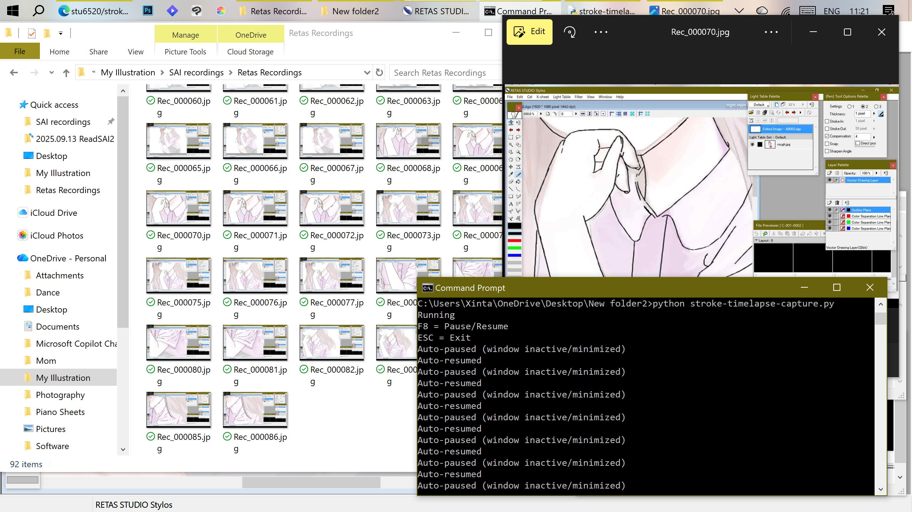
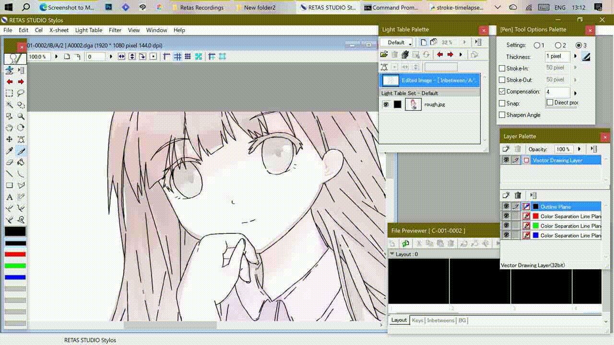

Tested on 


## Setup

This script requires **Python 3.11**

Check your version:

```bash
python --version
```

Install dependencies:

```bash
py -3.11 -m pip install -r requirements.txt
```

Run:

```bash
py -3.11 stroke-timelapse-capture.py
```


# Stroke-Based Timelapse Capture

A lightweight Python script that automatically captures screenshots and saves them as sequentially numbered JPG images.

This tool is especially friendly for illustrators who want to create timelapse recordings of their work without recording idle time. It captures frames efficiently with small file sizes (around 60–70 KB each), making it suitable for long-hour drawing sessions.

Tested use case environments include:
- Wacom Mobile Studio Pro 13 Gen 1
- RETAS Studio Stylos






---

## Features
- Capture only when drawing
- Stroke-triggered screenshots
- Auto-pause when drawing app minimized
- Manual pause hotkey
- Optimized JPEG compression
- Sequential filenames:
  Rec_000000.jpg → Rec_000001.jpg

---

## Controls
Key | Action
----|------
F8 | Pause / Resume
ESC | Exit program

---
## Compatibility

This tool is tested and confirmed working on:

Python versions:
- ✅ 3.11 (recommended)
- ⚠ 3.12+ may cause input detection errors
- ❌ 3.13 currently unsupported due to pynput limitations

If you experience crashes or listener errors, install Python 3.11 and run the script using that version.


